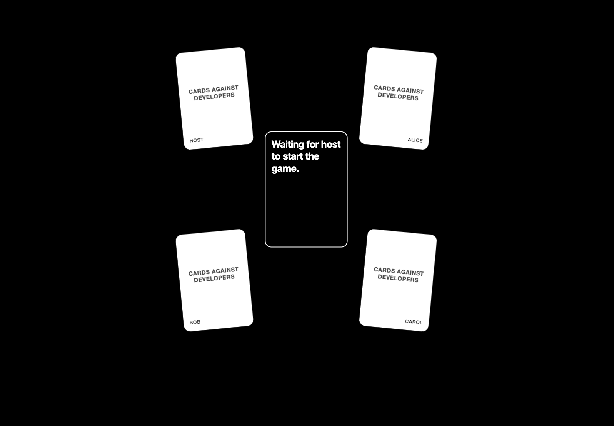
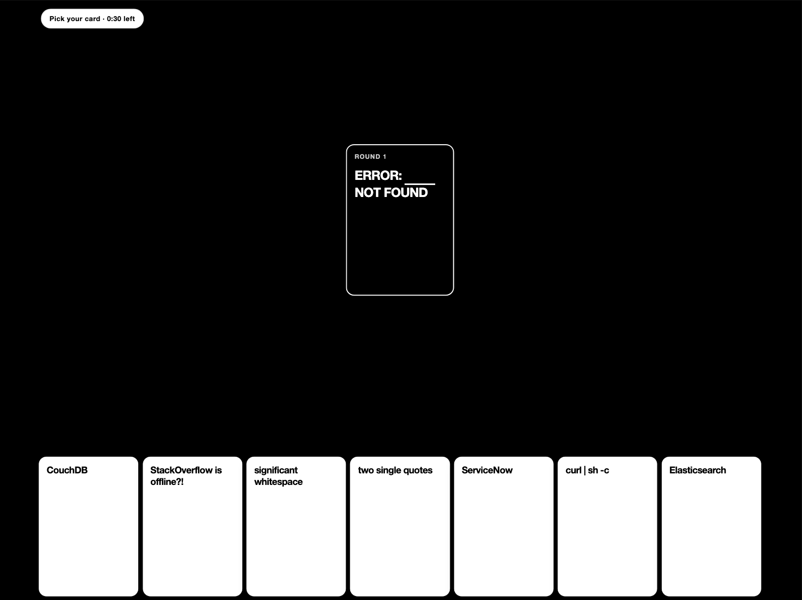
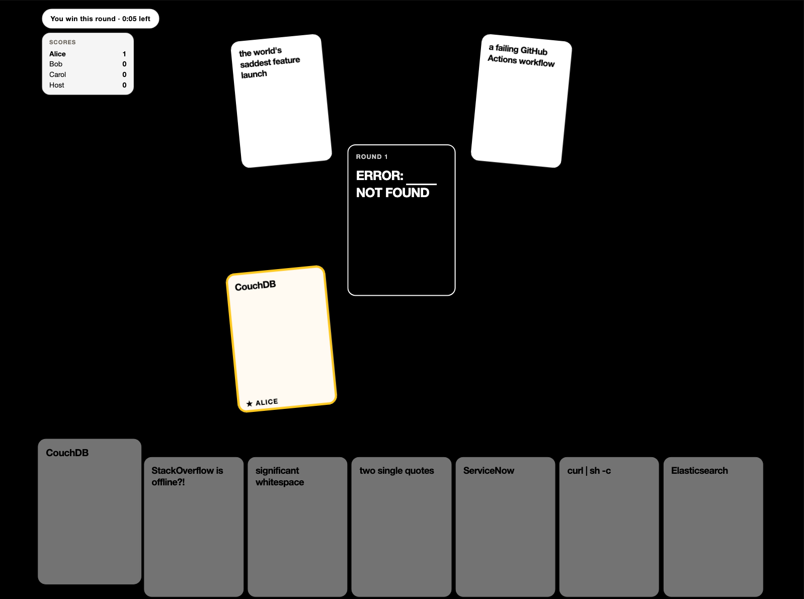

# Cards Against Developers

Browser-based party card game for developers.
It uses WebRTC to connect peer-to-peer without any hosting.

Go to https://cards-against-developers.github.io/game/ to play.







## Development

### Getting Started

```bash
npm install
npm run dev
```

### Local Play

For local development, the app exposes a hidden singleplayer route that boots a
four-seat table in one page:

- `/dev/singleplayer`

### Dev Routes

The build includes several routes used by Playwright and for manual UI inspection:

- `/dev/board-slots?count=4`
- `/dev/landing-status`
- `/dev/card-animations?stage=hand-picked`

### Testing

After making a change, run:

```bash
npm run format:check
npm run typecheck
npm run lint
npm run test:e2e
```

If screenshots change, regenerate them with:

```bash
npm run test:e2e:update
```

## Attribution

This project contains material derived from:

- https://github.com/bridgetkromhout/devops-against-humanity
- https://github.com/crashtest-security/CardsAgainstDevelopers
